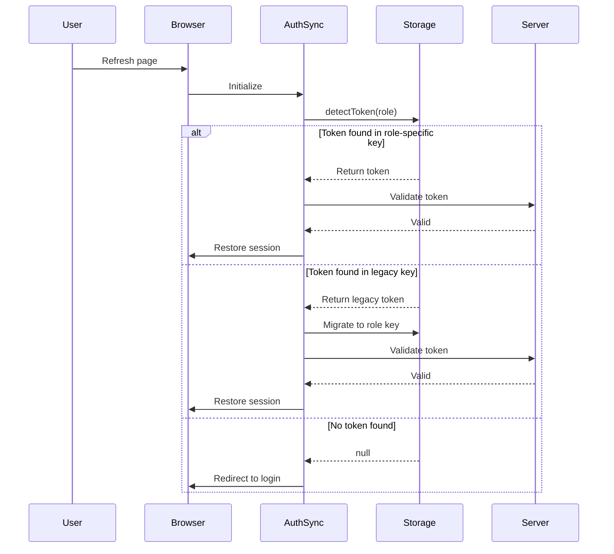

# @SPEC:AUTH-004 - 세션 지속성 및 역할별 토큰 감지 수정

## TAG BLOCK

```yaml
@SPEC:AUTH-004:
  title: "Session Persistence & Role-based Token Detection Fix"
  domain: "Authentication"
  priority: "critical"
  tags: ["session", "token", "persistence", "role-based", "auth-sync"]
  created: "2025-10-20"
  author: "@ClaudeCode"
  status: "draft"
  version: "0.0.1"

  chain:
    - from: "@SPEC:AUTH-001"  # 토큰 기반 인증 시스템
      relation: "enhances"
      note: "토큰 감지 및 저장 메커니즘 개선"

    - from: "@SPEC:AUTH-002"  # 역할 기반 라우팅
      relation: "depends-on"
      note: "역할별 토큰 키 구조 활용"

    - from: "@ISSUE:AUTH-SESSION-001"
      relation: "resolves"
      note: "페이지 새로고침 시 로그인 상태 유지 실패"

    - from: "@ISSUE:AUTH-SESSION-002"
      relation: "resolves"
      note: "역할별 토큰 감지 누락으로 인한 로그아웃"

  impact:
    components:
      - "lib/auth/auth-sync.ts"
      - "lib/auth/storage.ts"
      - "app/api/auth/me/route.ts"

    flows:
      - "토큰 감지 및 검증"
      - "세션 지속성 관리"
      - "역할별 스토리지 동기화"
```

---

## 1. ENVIRONMENT (환경 및 가정사항)

### 1.1 시스템 환경

**WHEN** the system operates in a Next.js 14+ environment,
**THE** authentication synchronization module **SHALL** support both client-side and server-side token detection.

**Constraints:**
- Browser localStorage as primary storage
- HTTP-only cookies as secondary storage
- Next.js App Router architecture
- Role-based access control system

### 1.2 현재 시스템 상태

**GIVEN** the current authentication implementation uses legacy single-key token storage,
**AND** role-based routing requires specific token keys per role,
**WHEN** users refresh the page or return to the application,
**THEN** the system **SHALL** detect tokens from both legacy and role-specific keys.

### 1.3 기술 스택

- **Frontend**: Next.js 14+, React 18+
- **Storage**: localStorage, HTTP-only cookies
- **Authentication**: JWT-based tokens
- **Roles**: super_admin, association_admin, lawyer, teacher

---

## 2. ASSUMPTIONS (전제 조건)

### 2.1 토큰 구조 가정

**ASSUMPTION:** Each role has a unique localStorage key:
- `super_admin_token` for super administrators
- `association_admin_token` for association administrators
- `lawyer_token` for lawyers
- `teacher_token` for teachers
- `token` for legacy compatibility

**ASSUMPTION:** Token expiration is managed server-side via JWT claims.

### 2.2 사용자 행동 가정

**ASSUMPTION:** Users may:
- Refresh the page during an active session
- Close and reopen the browser
- Navigate using browser back/forward buttons
- Switch between multiple tabs

### 2.3 호환성 가정

**ASSUMPTION:** The system must support:
- Gradual migration from legacy `token` key
- Dual-storage strategy (both legacy and role-specific keys)
- Backward compatibility for existing sessions

---

## 3. REQUIREMENTS (기능 요구사항)

### 3.1 Ubiquitous Requirements (모든 상황)

**R-AUTH-004-U01: 역할별 토큰 우선 감지**

**THE** token detection logic **SHALL** check role-specific keys first:
1. Determine current user role from session/state
2. Check `{role}_token` key in localStorage
3. If not found, fallback to legacy `token` key
4. If found, validate token structure and expiration

**R-AUTH-004-U02: 이중 저장 메커니즘**

**WHEN** a token is stored,
**THE** system **SHALL** write to both:
- Role-specific key: `{role}_token`
- Legacy key: `token` (for backward compatibility)

**R-AUTH-004-U03: 토큰 검증**

**THE** system **SHALL** validate detected tokens by:
1. Checking JWT structure (header.payload.signature)
2. Verifying expiration claim (`exp`)
3. Confirming role claim matches expected role
4. Ensuring token is not blacklisted

### 3.2 Event-Driven Requirements (특정 이벤트)

**R-AUTH-004-E01: 페이지 새로고침 시**

**WHEN** the user refreshes the page,
**THE** system **SHALL**:
1. Execute token detection on page load
2. Restore user session from detected token
3. Redirect to role-appropriate dashboard
4. Maintain previous navigation state if possible

**R-AUTH-004-E02: 브라우저 재시작 시**

**WHEN** the user closes and reopens the browser,
**AND** a valid token exists in localStorage,
**THE** system **SHALL**:
1. Detect token via role-specific key first
2. Restore session without requiring re-login
3. Validate token freshness (not expired)

**R-AUTH-004-E03: 토큰 만료 시**

**WHEN** a detected token is expired,
**THE** system **SHALL**:
1. Remove all token keys from localStorage
2. Clear server-side session cookies
3. Redirect to login page with expiration notice
4. Log expiration event for security audit

### 3.3 State-Driven Requirements (상태 전환)

**R-AUTH-004-S01: 로그인 → 인증 완료**

**WHILE** the user is in the login state,
**AND** authentication succeeds,
**THE** system **SHALL**:
1. Store token in role-specific key
2. Store token in legacy key for compatibility
3. Set HTTP-only cookie with token
4. Transition to authenticated state
5. Emit `auth:login` event

**R-AUTH-004-S02: 인증 완료 → 로그아웃**

**WHILE** the user is authenticated,
**AND** logout is triggered,
**THE** system **SHALL**:
1. Remove all token keys from localStorage
2. Clear all authentication cookies
3. Invalidate server-side session
4. Transition to unauthenticated state
5. Emit `auth:logout` event

**R-AUTH-004-S03: 토큰 갱신 상태**

**WHILE** the system detects a token nearing expiration,
**THE** system **SHALL**:
1. Attempt token refresh via `/api/auth/refresh`
2. Update both role-specific and legacy keys
3. Maintain user session without interruption
4. Log refresh event

### 3.4 Constraint Requirements (제약 조건)

**R-AUTH-004-C01: 성능 제약**

**THE** token detection process **SHALL** complete within:
- 50ms for localStorage reads
- 200ms for token validation
- 500ms for complete session restoration

**R-AUTH-004-C02: 보안 제약**

**THE** system **SHALL**:
- Never log full token values (only last 4 characters)
- Validate tokens server-side before granting access
- Implement rate limiting on token refresh (max 1 per minute)
- Clear all tokens on security events (suspicious activity)

**R-AUTH-004-C03: 호환성 제약**

**THE** system **SHALL**:
- Support browsers with localStorage API
- Gracefully degrade if localStorage is unavailable
- Maintain backward compatibility with legacy `token` key for 6 months
- Provide migration path from legacy to role-specific keys

---

## 4. SPECIFICATIONS (상세 명세)

### 4.1 토큰 감지 알고리즘

```typescript
/**
 * Token Detection Algorithm
 * Priority: Role-specific key > Legacy key > Cookie fallback
 */
function detectToken(role: UserRole): string | null {
  // Step 1: Check role-specific key
  const roleKey = `${role}_token`;
  const roleToken = localStorage.getItem(roleKey);

  if (roleToken && isValidToken(roleToken)) {
    return roleToken;
  }

  // Step 2: Check legacy key
  const legacyToken = localStorage.getItem('token');

  if (legacyToken && isValidToken(legacyToken)) {
    // Migrate to role-specific key
    localStorage.setItem(roleKey, legacyToken);
    return legacyToken;
  }

  // Step 3: Cookie fallback (server-side only)
  const cookieToken = getCookieToken();

  if (cookieToken && isValidToken(cookieToken)) {
    // Sync to localStorage
    localStorage.setItem(roleKey, cookieToken);
    localStorage.setItem('token', cookieToken);
    return cookieToken;
  }

  return null;
}
```

### 4.2 이중 저장 명세

```typescript
/**
 * Dual-Storage Strategy
 * Stores token in both role-specific and legacy keys
 */
function storeToken(role: UserRole, token: string): void {
  const roleKey = `${role}_token`;

  // Primary: Role-specific key
  localStorage.setItem(roleKey, token);

  // Secondary: Legacy key (backward compatibility)
  localStorage.setItem('token', token);

  // Tertiary: HTTP-only cookie (server-side)
  setSecureCookie('auth_token', token, {
    httpOnly: true,
    secure: true,
    sameSite: 'strict',
    maxAge: 24 * 60 * 60 // 24 hours
  });
}
```

### 4.3 토큰 제거 명세

```typescript
/**
 * Complete Token Removal
 * Clears all token storage locations
 */
function clearAllTokens(): void {
  // Remove all role-specific keys
  const roles = ['super_admin', 'association_admin', 'lawyer', 'teacher'];
  roles.forEach(role => {
    localStorage.removeItem(`${role}_token`);
  });

  // Remove legacy key
  localStorage.removeItem('token');

  // Clear cookies
  clearCookie('auth_token');

  // Clear server session
  fetch('/api/auth/logout', { method: 'POST' });
}
```

### 4.4 세션 복원 흐름



---

## 5. TRACEABILITY (추적성)

### 5.1 관련 SPEC

- `@SPEC:AUTH-001` - 토큰 기반 인증 시스템 (기반)
- `@SPEC:AUTH-002` - 역할 기반 라우팅 (의존)
- `@SPEC:AUTH-003` - 보안 감사 로깅 (연동)

### 5.2 해결 이슈

- `@ISSUE:AUTH-SESSION-001` - 페이지 새로고침 시 로그인 해제
- `@ISSUE:AUTH-SESSION-002` - 역할별 토큰 감지 누락
- `@BUG:AUTH-PERSISTENCE` - localStorage 동기화 실패

### 5.3 영향 컴포넌트

```yaml
files:
  - path: "lib/auth/auth-sync.ts"
    changes: "토큰 감지 로직 개선, 이중 저장 구현"

  - path: "lib/auth/storage.ts"
    changes: "역할별 키 관리, 마이그레이션 로직"

  - path: "app/api/auth/me/route.ts"
    changes: "토큰 검증 강화, 쿠키 폴백"

  - path: "components/providers/auth-provider.tsx"
    changes: "세션 복원 로직 업데이트"
```

---

## 6. RISKS & MITIGATION (리스크 및 대응)

### 6.1 마이그레이션 리스크

**Risk:** 기존 사용자의 세션이 legacy key에만 저장되어 있음

**Mitigation:**
- 자동 마이그레이션 로직 구현 (legacy key → role-specific key)
- 6개월간 dual-read 지원
- 점진적 레거시 키 제거 (2026-04-20 이후)

### 6.2 성능 리스크

**Risk:** 다중 키 체크로 인한 성능 저하

**Mitigation:**
- 역할별 우선순위 기반 단계별 체크
- 첫 번째 유효 토큰 발견 시 즉시 반환
- 토큰 캐싱 (메모리 내 5분간 유지)

### 6.3 보안 리스크

**Risk:** 여러 위치에 토큰 저장 시 노출 위험 증가

**Mitigation:**
- 모든 저장소에 동일한 보안 수준 적용
- 토큰 암호화 (AES-256)
- 정기적 토큰 갱신 (24시간마다)
- 의심 활동 감지 시 즉시 무효화

---

## 7. HISTORY (변경 이력)

### Version 0.0.1 (2025-10-20) - INITIAL

**Author:** @ClaudeCode
**Status:** draft
**Changes:**
- INITIAL SPEC creation
- EARS requirements defined (Ubiquitous, Event-driven, State-driven, Constraint)
- Token detection algorithm specified
- Dual-storage strategy designed
- Migration path from legacy key established
- Performance and security constraints documented

**Rationale:**
- Critical bug: 페이지 새로고침 시 로그인 상태 유실
- Root cause: auth-sync.ts가 legacy 'token' key만 체크, 역할별 키 미감지
- Solution: 역할별 우선 감지 + dual-storage + 자동 마이그레이션

**Dependencies:**
- @SPEC:AUTH-001 (토큰 인증 시스템)
- @SPEC:AUTH-002 (역할 기반 라우팅)

---

## 8. GLOSSARY (용어 정의)

- **Role-specific key**: 역할별 고유 localStorage 키 (예: `super_admin_token`)
- **Legacy key**: 기존 단일 토큰 키 (`token`)
- **Dual-storage**: 역할별 키와 레거시 키 동시 저장 전략
- **Token migration**: 레거시 키에서 역할별 키로 자동 전환
- **Session persistence**: 페이지 새로고침/브라우저 재시작 시 로그인 상태 유지
- **Token detection**: 저장된 토큰을 우선순위 기반으로 탐색하는 프로세스

---

## 9. REFERENCES (참고 자료)

### 9.1 관련 문서

- [EARS Notation Guide](https://alistairmavin.com/ears/)
- [JWT Best Practices](https://tools.ietf.org/html/rfc8725)
- [Web Storage API](https://developer.mozilla.org/en-US/docs/Web/API/Web_Storage_API)

### 9.2 코드 참조

- `lib/auth/auth-sync.ts` - 현재 토큰 동기화 로직
- `lib/auth/storage.ts` - 저장소 관리 유틸리티
- `app/api/auth/me/route.ts` - 사용자 정보 조회 API

---

**End of SPEC-AUTH-004**
